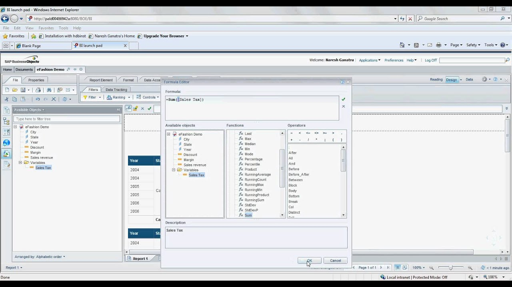

```{r setup, include=FALSE}
options(htmltools.dir.version = FALSE)
```

```{r xaringan-themer, include=FALSE, warning=FALSE}
library(xaringanthemer)
library(emo)
style_mono_accent(base_color = "#1996A9",
                 code_font_size = ".4rem",
                 link_color = "white",
                 text_font_family = "Roboto",
  text_font_url = "https://fonts.googleapis.com/css?family=Roboto:100,700,400italic",
  header_font_google = google_font("Lato"),
                  extra_css = list(
    ".small .remark-code" = list("font-size" = "50%"),
    ".tiny pre code" = list("font-size" = "33%"),
    ".large" = list("font-size" = "300%"),
    ".largeish" = list("font-size" = "200%")
  ))
```

```{r xaringanExtra, echo=FALSE}
xaringanExtra::use_xaringan_extra(c("tile_view", "logo", "tachyons"))
xaringanExtra::use_panelset()
xaringanExtra::use_tachyons()
#xaringanExtra::use_share_again()

```

class: title, middle, inverse

# Applying Data Science Methods to the EHR
### Frontiers Informatics December Meetup

.b[Sierra Davis] <br>
Children's Research Institute <br>
([`r icon::fa("envelope")`](mailto:ssdavis@cmh.edu) [ssdavis@cmh.edu](mailto:ssdavis@cmh.edu) | [`r icon::fa("twitter")`](https://twitter.com/__sierradavis)  [__sierradavis](https://twitter.com/__sierradavis))


---

```{r, echo=FALSE, out.width="85%"}

```
medium.com

---

# Data Science Projects

.center[
```{r, echo=FALSE, out.width="50%"}
knitr::include_graphics("img/ques.jpg")
```
]
---


# Outline

.large[

`r emo::ji("check")` .green[Data] Resources
]
--
.large[

`r emo::ji("check")` .green[Data] Science Methods
]
--
.large[
`r emo::ji("check")` .green[Data] Science Tools

]

---

class: center, middle

.large[

.green[Data] Resources

]

---

# Types of EHR

.pull-left[
.bg-light-gray.b--green.ba.bw2.br3.shadow-5.ph4.mt5.o-85.f5[
.b[Identified Data]
  - One Health System
  - Text Notes available
  - IRB Approval Requirement
  <br>
  <br>
  ]
  .center[.b[Cerner Millenium]]
  <br>
- .b[1.8 Million Patients]
- .b[14 Million Encounters]
]

--
.pull-right[
.bg-light-gray.b--green.ba.bw2.br3.shadow-5.ph4.mt5.o-85.f5[
.b[De-Identified Data]
  - Multiple Health Systems
  - HIPAA Compliant
  - Non Human Subject Research
  ]
.center[.b[Cerner Health Facts]]
<br>
- .b[69 Million Patients]
- .b[487 Million Encounters]
- .b[85 Facilities]
]

<br>
<br>
<br>
<br>
<br>

---

class: center, middle

```{r, echo=FALSE, out.width="95%"}

```


---

class: center, middle

.largeish[
Goal is to develop smaller .b[.red[manageable]] datasets from large scale EHR data to analyze, visualize and model.
]

---

class: center, middle

.large[

.green[Data] Science Methods

]

---

class: center, middle

```{r, echo=FALSE, out.width="95%"}
knitr::include_graphics("img/data-science.png")
```


<br>
<br>
<br>

Hadley Wickham

---


class: inverse, center, middle

.largeish[
Can .b[address level] pediatric data be used to investigate the relationship between household environments and health outcomes?
]

---


# KC-HEART


```{r, echo=FALSE, out.width="95%"}

```

<br>
<br>

---

.panelset[
.panel[.panel-name[Data Extraction]

- Data Request with IRB Approval submitted using REDCap Survey

- Asthma and Well Child Visits

- Address Level Data from 2000-2015
<br>
<br>
<br>
```{r, echo=FALSE, out.width="85%"}

```
]

.panel[.panel-name[Visualize]
```{r, echo=FALSE, out.width="95%"}

```
<br>
```{r, echo=FALSE, out.width="95%"}

```
]

]

---


class: inverse, center, middle

.largeish[
Can we use data from the EHR to reveal patterns and variations in .b[pediatric leukemia] patients that can be attributable to the organization and among patients?
]

---

.panelset[
.panel[.panel-name[Data Extraction]

- We identified a cohort of patients with ALL using ICD-9 and ICD-10 diagnosis codes and collected all available .b[.blue[timestamped]] encounters for each patient.
- Convert encounter-centric data architecture into a person-centric temporal design.

.pull-left[
.remark-code[
``` r
library(DBI)         
library(odbc)        
library(dplyr) 
library(dbplyr) 

SERVER   <- "servername"
VERSION  <- 2016    
DATABASE <- paste0("DBNAME", VERSION)
CAPTION  <- paste("EMR Data", VERSION)

EMR <- dbConnect(odbc(),
                         Driver="SQL Server",
                         Server=SERVER,
                         Database=DATABASE,
                         UID=Sys.getenv("EMR_UID"),
                         PWD=Sys.getenv("EMR_PWD"))
                         
encounter         <- tbl(EMR, in_schema("dbo", "ENCOUNTER"))
diagnosis         <- tbl(EMR, in_schema("dbo", "DIAGNOSIS"))
lab               <- tbl(EMR, in_schema("dbo", "LAB"))
all_diagnosis_encounters <-
  inner_join(encounter, diagnosis, by="encounter_id")   %>%
  select(patient_key
         encounter_id,
         diagnosis_code,
         encounter_type,
         admit_date,
         discharge_date,
         age,
         gender,
         race,
         ethncity,
         health_system,
         region)                    %>%
  filter(diagnosis_code %in% c('240.0','240.01'))
  collect()
all_lab_encounters <-
  left_join(all_diagnosis_encounters, lab, by="encounter_id")   %>%
  select(patient_key
         encounter_id,
         lab_date
         loinc_code,
         lab_desc,
         lab_result)                    %>%
  filter(loinc_code %in% c('xxxx','xxxx'))
  collect()
```
]
]

.pull-right[
```{r echo=FALSE,fig.width=25, message=FALSE, warning=FALSE, out.width = "125%"}

```
]
]

.panel[.panel-name[Descriptive Statistics]
<br>
<br>
```{r echo=FALSE, message=FALSE, warning=FALSE, out.width="25%"}
library(gtsummary)
library(dplyr)
library(lubridate)
library(ggplot2)
theme_gtsummary_compact()
summarize<-read.csv('HF18-Leukemia-ALL-AML-Patient-Trajectory-Encounter-Summary1.csv') %>% 
  mutate(FirstAdmit = as.Date(FirstAdmit), year=lubridate::year(FirstAdmit))

summarize %>% 
  select(Type,minAge,Records,UrbanRural) %>% 
  tbl_summary(
    by=Type,
    label= list(minAge ~ "Age",Records ~ "Encounters",UrbanRural ~ "Area of Care")) %>% 
    add_overall() %>% 
    bold_labels() 
```
]

.panel[.panel-name[Visualization]
- We identified ALL patients with over 180,000 encounters from health systems
.center[
```{r echo=FALSE, message=FALSE, warning=FALSE,out.width = "45%"}

```
]
<br>
- Timelines were developed to compare treatment among patients
<br>
.center[
```{r echo=FALSE, fig.width=25, message=FALSE, warning=FALSE, out.width="99%"}

#extrafont::loadfonts(device="pdf")
#extrafont::loadfonts(device="postscript")
#extrafont::loadfonts(device="win")
library(hrbrthemes)
library(ggplot2)

protocol <-data.frame(status = c("induction","induction","induction","induction","induction","induction","induction"),
                               day=c(1,4,8,15,22,29,35))

status_colors <- c("#005cb9", "#b95d00")

standard_risk<-read.csv("timeline-1.csv")
standard_risk$sourcekey<-as.character(standard_risk$sourcekey)

ggplot(data=standard_risk,aes(x=days,y=0,col=status, label=event))+
   scale_color_manual(values=status_colors, drop = TRUE)+
  geom_hline(yintercept=0, 
             color = "#1c1a1a", size=1.6)+
  geom_segment(data=standard_risk, aes(y=position,yend=0,xend=days,color=sourcekey), color = "gray80", size = 2)+
  geom_point(data=standard_risk,aes(y=0,color=sourcekey), size=5)+
  geom_text(data=protocol, aes(x=day,label=day, vjust=3),family="Roboto Condensed",size=6, color='black')+
  geom_text(aes(y=text_position,label=event,color=sourcekey),family="Roboto Condensed",fontface="bold",size=6.5)+
  annotate("text", x = 16, y = .5, label = "Patient 1",family="Roboto Condensed",fontface="bold.italic",color="#005cb9",size=8)+
  annotate("text", x = 16, y = -.5, label = "Patient 2",family="Roboto Condensed",fontface="bold.italic",color="#b95d00",size=8)+
  theme_ipsum_rc(base_family="Roboto Condensed",grid="N")+
  labs(
    x = "", y = NULL,
    title = "Standard Risk Patients - Patient Timeline in Induction Cycle"
  ) +
  
  theme(axis.line.y=element_blank(),
        axis.text.y=element_blank(),
        axis.title.y=element_blank(),
        axis.ticks.y=element_blank(),
        axis.text.x =element_blank(),
        axis.ticks.x =element_blank(),
        axis.line.x =element_blank(),
        plot.background = element_rect(fill = "#f3f3f4"),
        panel.background = element_rect(fill = "#f3f3f4",
                                colour = "#f3f3f4"),
        legend.position = "none"
  )
```
]

<br>
Davis, S., Wood, N., Glynn, E., Lewing, K., Caragea, D., Noel-MacDonnell, J., and Hoffman, M. (2020).
Comparing the Treatment Regimen of Newly Diagnosed Pediatric Leukemia Patients
]


.panel[.panel-name[Results]
 
# Lumbar Punctures
.center[
```{r echo=FALSE, message=FALSE, warning=FALSE,out.width = "95%"}

```
]
]

.panel[.panel-name[Modeling]

# Future Work

.largeish[
- Identify Subtle Patterns using Cluster Analysis
]
.largeish[
- Deep Learning
]

]

]


---


class: center, middle

.large[

.green[Data] Science Tools

]

---

# Data Science Tools

```{r echo=FALSE, message=FALSE, warning=FALSE,out.width = "95%"}

```

---

# Reproducible Research

```{r, echo=FALSE, out.width="95%"}

```

---

# Colaborative Relationships
.pull-left[
.largeish[
- Understanding Context
]
.largeish[
- Data Interpretation
]
.largeish[
- Finding Data
]
]


.pull-right[
```{r, echo=FALSE, out.width="99%"}
knitr::include_graphics("img/teamwork.png")
```
]
---


# Conclusion
.large[

`r emo::ji("check")` .green[Data] Resources
]

.large[

`r emo::ji("check")` .green[Data] Science Methods
]

.large[
`r emo::ji("check")` .green[Data] Science Tools

]
---
class: middle, inverse

.large[Thank You]


---

